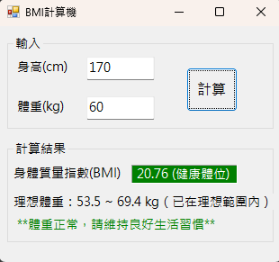

# BMI計算機

視窗程式設計 (II) 上課範例

## 功能介紹
- 輸入身高 (cm) 與體重 (kg)
- 計算 BMI 值
- 顯示 BMI 分類（過輕、正常、過重、輕度肥胖、中度肥胖、重度肥胖）
- 計算理想體重區間
- 顯示健康建議

## 使用方式
輸入身高與體重後，點擊「計算」按鈕，即可顯示：
- BMI 值
- BMI 分類（過輕、正常、過重、輕度肥胖、中度肥胖、重度肥胖）
- 理想體重範圍
- 健康建議

## 計算公式
BMI = 體重 (kg) / 身高² (m²)

## 執行畫面

## 開發環境
- C#
- Windows Forms
- Visual Studio

## 備註
- 身高輸入單位為公分 (cm)
- 體重輸入單位為公斤 (kg)
- 已加入輸入驗證（數字與正值檢查）